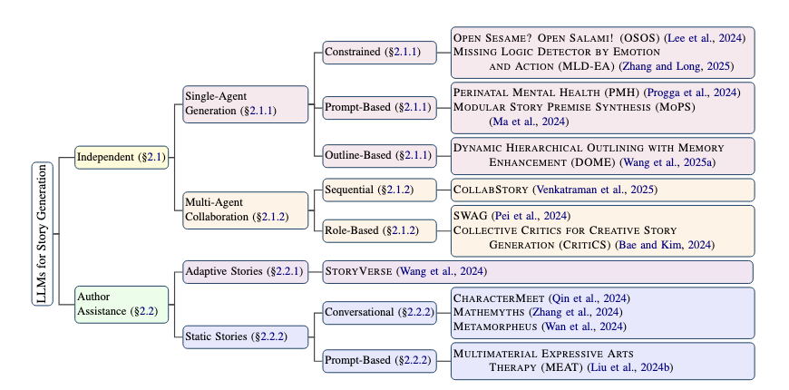
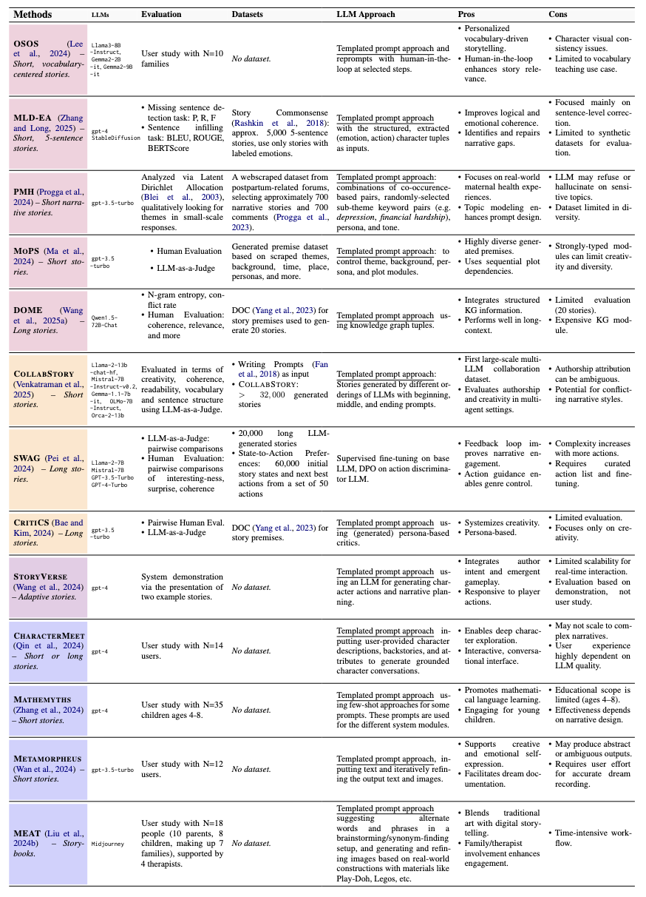

# 📚 A Survey on LLMs for Story Generation

This repository is for our EMNLP Findings '25 paper, [**A Survey on LLMs for Story Generation**](./A_Survey_on_LLMs_for_Story_Generation.pdf). 

**Authors:** Maria Teleki, Vedangi Bengali*, Xiangjue Dong*, Sai Tejas Janjur*, Haoran Liu*, Tian Liu, Cong Wang, Ting Liu, Yin Zhang, Frank Shipman, James Caverlee (Texas A&M University)

---

## 🌟 Contributions

**We aim to serve the community with this repository -- if you have systems to add, please send us a pull request!**

---

## 🔍 Overview
This repository hosts the survey paper **"A Survey on LLMs for Story Generation"**, which presents a comprehensive taxonomy, comparison, and future outlook on the use of Large Language Models (LLMs) for story generation.

Key contributions:
- Proposes a **novel taxonomy** for LLMs in story generation:  
  - **Independent Generation** (LLMs as primary authors)  
  - **Author Assistance** (LLMs supporting human authors)
- Provides systematic **comparisons** of datasets, evaluation methods, and LLM usage.  
- Outlines **future research directions** in multimodal storytelling, inference-time control, benchmarking, and story-specific metrics.

---

## 🗂 Taxonomy



### 1. Independent
LLMs act as the **primary author**.
- **Single-Agent Generation**
  - *Constrained*: 
    - OSOS [CHI '24] [[Paper]](https://dl.acm.org/doi/10.1145/3613904.3642580)
    - MLD-EA [COLING '25] [[Paper]](https://aclanthology.org/2025.coling-main.129/)
  - *Prompt-Based*: 
    - PMH [CSCW '24] [[Paper]](https://dl.acm.org/doi/10.1145/3678884.3681921)
    - MoPS [ACL '24] [[Paper]](https://aclanthology.org/2024.acl-long.117/)
    - CCI [ACL Findings '25] [[Paper]](https://aclanthology.org/2025.findings-acl.82/)
  - *Outline-Based*: 
    - DOME [NAACL '25] [[Paper]](https://aclanthology.org/2025.naacl-long.63/) [[Code]](https://github.com/Qianyue-Wang/Generating-Long-form-Story-Using-Dynamic-Hierarchical-Outlining-with-Memory-Enhancement) [[Dataset]](https://github.com/Qianyue-Wang/DOME_dataset)
    - STORYTELLER [ACL '25] [[Paper]](https://aclanthology.org/2025.findings-acl.1071.pdf) 
- **Multi-Agent Collaboration**
  - *Sequential*: 
    - CollabStory [NAACL '25] [[Paper]](https://aclanthology.org/2025.findings-naacl.203/) [[Code]](https://github.com/saranya-venkatraman/CollabStory)
  - *Role-Based*: 
    - SWAG [EMNLP Findings '24] [[Paper]](https://aclanthology.org/2024.findings-emnlp.824/) [[Code]](https://github.com/jonnypei/swag-storytelling)
    - CritiCS [EMNLP '24] [[Paper]](https://aclanthology.org/2024.emnlp-main.1046/) [[Code]](https://github.com/EMNLP-2024-CritiCS/Collective-Critics-for-Creative-Story-Generation)
  - *Persona-Based*:
    - Smallville [UIST '23] [[Paper]](https://dl.acm.org/doi/10.1145/3586183.3606763) [[Code]](https://github.com/joonspk-research/generative_agents)
    - AuraSight [[Paper]](http://arxiv.org/abs/2509.08927)

### 2. Author Assistance
LLMs act as **assistants to human authors**.
- **Adaptive Stories**
  - StoryVerse [FDG '24] [[Paper]](https://dl.acm.org/doi/10.1145/3649921.3656987)
  - CALYPSO [AIIDE '23] [[Paper]](https://ojs.aaai.org/index.php/AIIDE/article/view/27534) [[Code]](https://github.com/northern-lights-province/calypso-aiide-artifact)
  - ChatGPT-as-a-Game-Master [IAIT '23] [[Paper]](https://dl.acm.org/doi/10.1145/3628454.3628457)
- **Static Stories**
  - *Conversational*: 
    - CharacterMeet [CHI '24] [[Paper]](https://dl.acm.org/doi/10.1145/3613904.3642105)
    - Mathemyths [CHI '24] [[Paper]](https://dl.acm.org/doi/10.1145/3613904.3642647) 
    - Metamorpheus [CHI '24] [[Paper]](https://dl.acm.org/doi/10.1145/3613904.3642410)
  - *Prompt-Based*: 
    - MEAT [CHI '24] [[Paper]](https://dl.acm.org/doi/10.1145/3613904.3642852)

---

## 📊 Comparison Table


---

## 🚀 Future Directions
- **Multimodal Storytelling**: Integration of VLMs and image-text generation.  
- **Inference-Time Constraints**: Beam search & rule-based sampling for coherence.  
- **Benchmarking**: Lack of standardized benchmarks across LLMs.  
- **Story-Specific Metrics**: New metrics like *Automatic Story Evaluation (ASE)*.  
- **Ethical Concerns**: Authorship, originality, professional impact, transparency.  

---

## 📑 Paper Selection
Surveyed works span **ACL, EMNLP, NAACL, COLING, TACL, CHI, CSCW**, and other top venues (2023–2025). Focus is on **storytelling (non-data-centric)** with LLMs post-2022 (GPT-4 era).

---

## 📌 Citation
If you use this survey, please cite:

```bibtex
@article{teleki2025survey,
  title={A Survey on LLMs for Story Generation},
  author={Teleki, Maria and Bengali, Vedangi and Dong, Xiangjue and Janjur, Sai Tejas and Liu, Haoran and Liu, Tian and Wang, Cong and Liu, Ting and Zhang, Yin and Shipman, Frank and Caverlee, James},
  year={2025},
  journal={EMNLP Findings}
}
```
